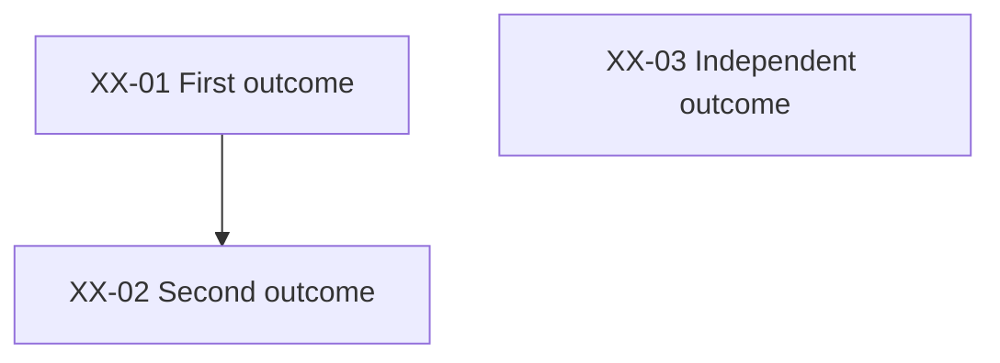

# Feature idea documentation format

Use this when constructing a package without repository templates, revising interconnected documents, or running the bundled checker. Repository conventions take precedence; this is a portable fallback rather than a required migration of existing documentation.

## Package and index

```text
future-plans/
  README.md
  _idea-template.md
  _ticket-template.md
  feature-slug/
    PLAN.md
    TICKETS.md
    RISKS.md
    tickets/
      XX-01-outcome.md
      XX-02-outcome.md
```

Create the two reusable template files only when bootstrapping a repo that has none; adapt the outlines below. A separate CONTRACTS.md is useful only when detailed interfaces would obscure the product spec. Do not create empty placeholder documents.

The idea index has ID, title/link, status, description, and planning-material links. Use `FP-001`, `FP-002`, etc. as the fallback proposal IDs; allocate without colliding with existing or retired IDs. Include an Idea inbox for short entries. For that inbox, use “Title — problem; intended benefit; next question” without mandatory tickets.

Proposal states: Idea, Planned / not scheduled, Scheduled, In progress, Done, Dropped. Ticket states: Backlog, Ready, In progress, Blocked, Done. Preserve the repo's vocabulary if different. A graph root is dependency-free, not automatically authorized or Ready.

## PLAN.md outline

Start with title, ID, status, recorded date, related proposals, and planning-material links. State that a future proposal does not describe delivered behavior or change the current implementation agreement.

Use these sections, merging short ones when clarity improves:

1. **Problem and audience:** the problem in the user's terms and observable success.
2. **Proposed experience and scope:** a concrete flow, examples where useful, accepted rules, corrections, and important failure cases. Identify preserved behavior.
3. **Exclusions:** only meaningful boundaries that prevent likely scope mistakes.
4. **Approach and affected interfaces:** reuse, data flow, APIs/schema/module boundaries, compatibility, and migrations at the depth justified by the decisions. Avoid speculative wire formats and file inventories.
5. **Assumptions and open decisions:** distinguish confirmed choices from defaults and unresolved questions. Give open questions an owner/ticket and a point at which they must be resolved.
6. **Validation and rollout:** unchecked observable criteria, relevant regression/failure scenarios, and proportionate release/recovery considerations. Respect existing authorization rather than adding arbitrary approvals.
7. **Tickets and dependencies:** link to TICKETS.md.
8. **Risks and references:** link to RISKS.md and relevant repository/primary sources. Date external facts that will need rechecking.
9. **Completion evidence:** “Not implemented” for new future work; actual evidence and limitations for work genuinely performed.

## Ticket outline

Each ticket is its own file with stable ID and bounded outcome:

```markdown
# XX-01: Outcome

- **Status:** Backlog
- **Proposal:** [Feature](../PLAN.md)
- **Depends on:** None
- **Risks:** [R01](../RISKS.md#r01)

## Context and objective
## Prerequisites
## Included work
## Excluded work
## Affected interfaces
## Acceptance checks
- [ ] Observable successful behavior.
- [ ] Relevant failure, rejection, retry, or compatibility behavior.
## Completion evidence
Not started.
```

Replace empty outline headings with concrete content. Prerequisites must match the declared dependency graph; use prose for external setup or scheduling gates. Acceptance checks should establish behavior, not merely that a file exists. Include relevant tests in the ticket that delivers the behavior. A final validation ticket, when useful, tests interactions rather than postponing all testing.

The index uses this table:

```markdown
| ID | Ticket | Status | Depends on |
| --- | --- | --- | --- |
| [XX-01](tickets/XX-01-outcome.md) | First outcome | Backlog | — |
| [XX-02](tickets/XX-02-outcome.md) | Second outcome | Backlog | [XX-01](tickets/XX-01-outcome.md) |
```

Arrows mean prerequisite → dependent. Include every active ticket, even an isolated node:



Describe parallel work only where the graph permits it. Shared files may still require coordination; independence does not mean an unfinished feature can be deployed. Avoid redundant transitive edges unless the repo intentionally records them.

## Risk register

Start with proposal/index links, recorded date, and a statement that estimates are qualitative and mitigations are unverified for future work.

```markdown
| ID | Risk | Severity | Likelihood | Responsible tickets |
| --- | --- | --- | --- | --- |
| [R01](#r01) | Concrete failure and impact | High | Medium | XX-01, XX-02 |

## R01

Describe the failure scenario and practical consequence.

**Mitigation:** The work that reduces the risk.

**Verification / gate:** How the responsible tickets demonstrate the mitigation, including any unresolved external prerequisite.
```

Ticket Risks metadata and Responsible tickets must agree in both directions. Risk IDs are scoped to the proposal. Include only concrete risks, with severity and likelihood proportional to the scenario. If analysis finds none worth tracking, write that explicitly; the checker accepts a register with the line `No material risks identified.` and ticket metadata `Risks: None`.

## Revisions

Before editing, identify every representation of the changed decision: spec, affected ticket scopes/criteria, graph, risk ownership, index summary, and optional contracts. Update those representations together.

Retain IDs for surviving tickets. Remove superseded unstarted tickets from the active index/graph and explain their retired IDs; retain evidence or archived material when work actually occurred. Retired IDs must remain discoverable to prevent reuse. Retiring a ticket is not completing it. Do not rewrite unrelated proposals to make them match an unaccepted assumption.

For example, removing authentication from an embedded-UI idea removes its authentication deliverables and dependency edges; it does not weaken the separate multi-user proposal. Changing a field from optional to required updates completion, correction, migration, and acceptance rules together.

## Checker contract and limits

`validate_feature_docs.py PROPOSAL_DIR [--index IDEA_INDEX]` uses Python's standard library and never writes files or makes network requests. The default index is `PROPOSAL_DIR/../README.md`.

Supported structure: PLAN.md, TICKETS.md, RISKS.md, and tickets/*.md. Metadata uses `- **Key:** Value`; proposal identity may use ID or Idea. Ticket titles use `# XX-01: Title`. Ticket/risk tables use the columns above. Proposal index rows contain unique `FP-NNN` IDs (other uppercase prefixes work too).

Supported links: ordinary inline Markdown local paths/anchors and standard ATX heading anchors, including repeated-heading suffixes; URL-encoded paths are decoded. External URLs are skipped, not certified. Bare file mentions are not links. Reference-style links and advanced Markdown destinations are reported as unsupported instead of silently skipped.

Supported Mermaid: one `mermaid` block containing `flowchart TD`/`LR` or `graph TD`/`LR`, one `-->` edge per line, and standalone nodes. Nodes may use quoted bracket labels containing the ticket ID, or an alias equal to the ticket ID with hyphens removed. Repeated declarations and edges with unlabeled nodes are supported. Subgraphs, chained/annotated edges, and other syntax produce an explicit coverage error.

Exit codes: **0** structural checks pass; **1** broken links or inconsistent documentation; **2** missing/unreadable input or unsupported format. Read every reported diagnostic. A pass does not establish that acceptance criteria are useful, scope is accepted, technical claims are true, implementation is done, or a release is authorized. Review those separately. A documented legacy inconsistency remains a finding; do not modify an unrelated proposal just to obtain a pass.
