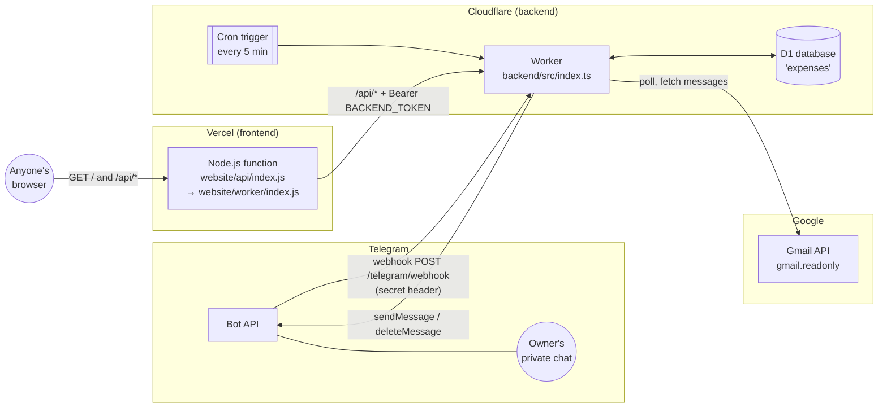

# Architecture

This page covers what the system is made of, how the parts talk to each other, and where each piece lives in the repository. Read it first; every other doc assumes this picture.

## What the product does

The owner's bank (UZCARD) sends an email for every card transaction. The tracker:

1. **Reads** those emails from a dedicated Gmail inbox every five minutes (read-only access).
2. **Parses** each one into a transaction (amount, merchant, time, card suffix, direction) and **saves** it.
3. **Asks** the owner on Telegram for a category and a short description.
4. **Shows** everything on a public web dashboard. There you can search, filter, see totals and a monthly calendar, edit details, and add cash or other transactions by hand.

It is a single-owner app. Everything runs in the `Asia/Tashkent` timezone, and there is no currency conversion.

## System diagram



There are two deployable units:

| Unit | Code | Hosted on | Runs |
|---|---|---|---|
| **Backend** | [`backend/`](../backend) (TypeScript) | Cloudflare Worker `personal-expenses`, with D1 database `expenses` | Cron every 5 minutes (Gmail polling, reminders, Telegram delivery), the Telegram webhook, and the authenticated JSON API |
| **Website** | [`website/`](../website) (plain JavaScript) | Vercel Hobby project `spartak5/personal-expenses` | Serves the single-page dashboard and forwards a small allowlist of `/api/*` calls to the backend |

The public URLs are the dashboard at https://personal-expenses-liard-chi.vercel.app and the backend at https://personal-expenses.oybek-expenses-4801.workers.dev. The backend API is useless without the token.

## Why it is split this way

- **The browser never holds a secret.** The dashboard is intentionally public with no login, so it cannot be trusted with the backend token. The Vercel function keeps `BACKEND_TOKEN` in a server-side environment variable and attaches it to the requests it forwards. It forwards only list, edit, create, totals, insights and health requests. Administrative routes such as `/api/activate` are unreachable from the website.
- **The backend is closed by default.** Every `/api/*` call needs `Authorization: Bearer BACKEND_TOKEN`. The Telegram webhook needs Telegram's secret header *and* must come from the owner's private chat.
- **Parsing, saving and notifying are separate steps.** An email is parsed by a pure function, saved in one atomic database batch together with a "to-do" row in an **outbox** table, and only later delivered to Telegram by a separate step. If Telegram is down, nothing is lost: the outbox row is retried. If Gmail is down, reminders and deliveries still run. See [transaction-lifecycle.md](transaction-lifecycle.md).
- **Cloudflare Workers plus D1** give free scheduled execution (Cron Triggers) and a SQLite database next to the code. **Vercel** hosts the public page, and it was chosen when the old private hosting was retired.

## Trust boundaries

| Caller | Endpoint | How it is authenticated | Code |
|---|---|---|---|
| Anyone | Dashboard `/`, and `/api/expenses`, `/api/totals`, `/api/insights`, `/api/health` through Vercel | None (public by design). Writes (POST/PATCH) must be same-origin JSON | [`website/worker/index.js`](../website/worker/index.js) |
| Vercel function | Backend `/api/*` | `Authorization: Bearer BACKEND_TOKEN`, compared in constant time | `api()` in [`backend/src/api.ts`](../backend/src/api.ts), `equalSecret()` in [`backend/src/domain.ts`](../backend/src/domain.ts) |
| Owner's scripts | Backend `/api/activate`, `/maintenance/*` | Same Bearer token, called directly (not through Vercel) | [`scripts/integrations.mjs`](../scripts/integrations.mjs), [`scripts/switch-gmail.mjs`](../scripts/switch-gmail.mjs) |
| Telegram | Backend `POST /telegram/webhook` | `X-Telegram-Bot-Api-Secret-Token` header must equal `TELEGRAM_WEBHOOK_SECRET`. Chat and sender must both equal `TELEGRAM_OWNER_ID`, and the chat must be private | [`backend/src/index.ts`](../backend/src/index.ts), `ownerUpdate()` in [`backend/src/telegram.ts`](../backend/src/telegram.ts) |
| Google's OAuth reviewers | Backend `/about`, `/privacy`, `/terms` | None (static pages) | [`backend/src/information.ts`](../backend/src/information.ts) |

Everything that comes from an email or from Telegram is treated as **untrusted input**. It is validated with strict patterns, length limits and allowlists before it is stored.

## Repository map

```
backend/              Cloudflare Worker (TypeScript) and D1 migrations
  src/index.ts        Entry point: HTTP router and cron handler
  src/gmail.ts        Gmail OAuth refresh, polling, pagination, checkpoints
  src/parser.ts       Pure email parsing: MIME walk, UZCARD line format, review reasons
  src/store.ts        Database helpers: saveMessage (atomic transaction + outbox), getExpense, lock, enqueue
  src/http.ts         The shared `json()` response helper (no-store caching)
  src/domain.ts       Shared types (Env, Expense), categories, money and Tashkent time helpers, equalSecret
  src/telegram.ts     Outbox delivery, retries, cleanup, reminders, webhook update handling
  src/api.ts          Authenticated JSON API: list/filter, totals, month insights, health, activate, create, edit
  src/manual.ts       Validation (`manualDetails`) and idempotent persistence (`saveManual`) of manually entered transactions
  src/information.ts  Static /about, /privacy, /terms pages (needed for Google OAuth branding)
  src/maintenance.ts  Separate Worker entry point used only during a mailbox switch (never deployed normally)
  migrations/         D1 SQL migrations, applied in order (0001–0004)
  wrangler.toml       Worker name, cron schedule, D1 binding, SITE_URL
website/              Public dashboard deployed to Vercel
  worker/index.js     Proxy and page server (the security boundary for the public site)
  worker/page.html    Markup and all CSS
  worker/dark-tokens.css  The dark palette, injected into both dark blocks at build time
  worker/client.js    All browser JavaScript (no framework)
  api/index.js        Vercel adapter: imports the built dist/server/index.js
  scripts/            Build (inlines page and client into one module) and post-build validation
  vercel.json         Rewrites / and /api/* to the function
tests/                node:test suites with a real in-memory SQLite database and mocked fetch
scripts/              Owner-run helpers: OAuth, secrets upload, Telegram setup, activation, mailbox switch, local preview
docs/                 These docs, SETUP.md (provisioning), history.md (dated records), screenshots/
future-plans/         Unscheduled proposals (e.g. multi-user pilot). Not implemented
.claude/skills/       Agent runbooks: deploy-backend, deploy-website, design-ui
PLAN.md               The agreed product scope and rules (source of truth for behavior)
CONTEXT.md            Domain vocabulary (see also docs/glossary.md)
AGENTS.md             Rules for anyone (human or AI) changing the code
```

## Key design rules

These rules come from [PLAN.md](../PLAN.md) and [AGENTS.md](../AGENTS.md), and the code relies on them:

- **Money is exact.** Amounts are stored as integer *minor units* (tiyin or cents: `30500.00 UZS` is stored as `3050000`). Totals are summed with `BigInt` and returned as decimal strings. Floating point is never used for money.
- **Time is explicit.** Timestamps are stored in UTC. Bank times are read as `Asia/Tashkent`, which is a fixed UTC+05:00 with no daylight saving. Days and months in totals and filters are Tashkent days.
- **No full emails or balances are stored.** Only the parsed fields and the Gmail message ID are kept.
- **Nothing is imported before activation.** Polling does nothing until the owner calls `/api/activate` once. Emails received earlier are ignored forever.
- **Save first, notify second.** A transaction and its notification job are written in one atomic batch. Delivery is retried separately.
- **Idempotency everywhere.** Gmail message IDs, Telegram update IDs, outbox IDs and manual-entry request IDs all make retries harmless.

## Reimbursement boundary

FP-003 is deployed (6 October 2026). `domain.ts` owns the shared completion predicate, `reimbursements.ts` owns versioned relationship mutations and atomic receipt enqueueing, and `reporting.ts` owns exact financial projections used by API reports and daily summaries. Database triggers protect every write path. Parsing still saves raw bank fields independently of notification delivery. Reimbursements request a name and expense link through the shared dashboard instead of a description reply. The frontend proxy allows only the bounded candidate/detail reads and forwards the required browser contract header; the backend token remains server-side. See [contracts](../future-plans/expense-reimbursements/CONTRACTS.md).
