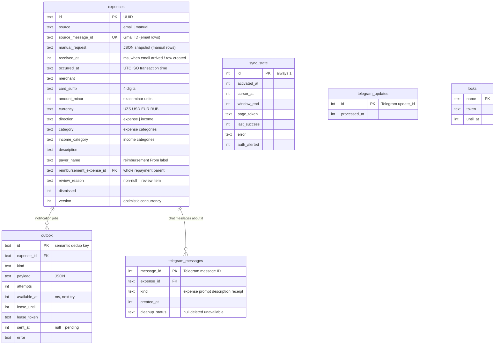

# Data model

This page covers every table in the D1 (SQLite) database, what each column means, how money and time are stored, and how to change the schema safely. The schema is defined only by the migrations in [`backend/migrations/`](../backend/migrations). This page describes the candidate schema after `0005_reimbursements.sql`; reimbursement deployment remains separately gated.

## Tables at a glance

## `expenses`: one row per transaction

The table name is historical. It holds **income** as well as spending, plus review items and manual entries.

| Column                                                | Meaning                                                                                                                                                                                        |
| ----------------------------------------------------- | ---------------------------------------------------------------------------------------------------------------------------------------------------------------------------------------------- |
| `id`                                                  | UUID primary key. For manual rows it is also the client's request ID.                                                                                                                          |
| `source`                                              | `email` (imported from Gmail) or `manual` (entered on the dashboard).                                                                                                                          |
| `source_message_id`                                   | Gmail message ID. It is UNIQUE, which makes email import idempotent. It is NULL for manual rows.                                                                                               |
| `manual_request`                                      | For manual rows, the JSON of the originally validated create request. It is used to tell a harmless retry apart from a conflicting reuse of the same ID. It is **not** updated by later edits. |
| `received_at`                                         | Milliseconds since epoch: when Gmail received the email, or when the manual row was created.                                                                                                   |
| `occurred_at`                                         | Transaction time as a UTC ISO string, parsed from the Tashkent time in the email.                                                                                                              |
| `merchant`, `card_suffix`, `amount_minor`, `currency` | Parsed transaction fields. `amount_minor` must be greater than 0 and at most 2⁵³−1. `card_suffix` is optional for manual rows.                                                                 |
| `direction`                                           | `expense` or `income`.                                                                                                                                                                         |
| `category`                                            | One of Transport, Food, Groceries, Shopping, Bills, Health, Entertainment, Other. Used by expenses.                                                                                            |
| `income_category`                                     | One of Salary, Reimbursement, Other income. Used by income.                                                                                                                                    |
| `description`                                         | The owner's note. It is `''` until provided; optional for reimbursements.                                                                                                                      |
| `payer_name`                                          | Trimmed reimbursement From label, at most 100 Unicode code points. Defaults to `''`; migration never infers names.                                                                             |
| `reimbursement_expense_id`                            | Nullable foreign key to one original expense. The entire repayment is linked; no split allocations.                                                                                            |
| `review_reason`                                       | Non-NULL means the parser refused to guess. All transaction fields are then NULL and the row is excluded from totals.                                                                          |
| `dismissed`                                           | 1 hides a review item from lists and totals. There is no hard delete.                                                                                                                          |
| `version`                                             | Incremented on every change. Edits must send the version they read.                                                                                                                            |

**CHECK constraints** protect the data even if the code has a bug:

- A row is either a review item, or it has every transaction field (card suffix is required only for email rows).
- Email rows need a `source_message_id`. Manual rows need `source_message_id IS NULL` and `manual_request IS NOT NULL`.
- Category values and `direction` are restricted to the lists above.

The indexes are `expenses_reimbursement_parent(reimbursement_expense_id)`, `expenses_time(occurred_at DESC)`, `outbox_pending(sent_at, available_at, lease_until)` and `telegram_messages_expense(expense_id, kind)`.

## Reimbursement relationships and completion

Migration 0005 adds only columns, an index, and triggers. It leaves IDs, bank fields, original manual snapshots, activation/cursor, outbox jobs, update deduplication and Telegram associations intact, with no migration messages or inferred links. Existing Reimbursement rows become pending. Trigger bodies must not use `CASE … END`: D1's server-side SQL parser ends the trigger at the `END;` that closes the `CASE` and rejects the migration with `incomplete input` (SQLite itself accepts it). The guards use `SELECT RAISE(ABORT, '…') WHERE <condition>;` instead.

A link requires resolved, undismissed incoming Reimbursement, a nonblank payer, and a resolved, undismissed expense with the same currency and an earlier or equal transaction time. The combined whole-payment allocations cannot exceed the parent's original amount. Triggers validate inserts and updates, including direct SQL and Telegram category writes. They reject invalidating source changes even when combined with unlinking, so unlink must be a separate save. Parent edits must keep all existing children eligible and within capacity. Capacity comparisons subtract existing allocations, excluding the source being replaced, and retain exact integer arithmetic.

The shared `complete()` and `needsDetailsSql()` predicates in `domain.ts` require payer plus link for a reimbursement; its note is optional. Ordinary transactions still require category and description. SQL whitespace handling matches JavaScript trimming. Link eligibility is independent of the parent's category/description completion. `getExpense()` remains a raw storage read.

## `outbox`: jobs to send to Telegram

Each row is one message to send or delete. **The `id` doubles as a dedup key**, and rows are created with `INSERT OR IGNORE`:

| `id` format                    | `kind`                | Created by                                                     | Guarantees                              |
| ------------------------------ | --------------------- | -------------------------------------------------------------- | --------------------------------------- |
| `expense:<expense id>`         | `expense` or `review` | `saveMessage()`                                                | one category prompt per imported email  |
| `prompt:<telegram update id>`  | `prompt`              | category button handler                                        | one prompt per button press             |
| `receipt:<expense id>`         | `receipt`             | description/category handler or email reimbursement completion | one receipt per transaction             |
| `delete:<telegram message id>` | `delete`              | `queueCleanup()`                                               | one delete per chat message             |
| `reminder:<YYYY-MM-DD>`        | `reminder`            | `reminder()`                                                   | one reminder per Tashkent day           |
| `auth:<cursor_at>`             | `auth`                | `pollGmail()`                                                  | one "reconnect Google" alert per outage |

Here is how the other columns behave:

- `sent_at IS NULL` means the row is pending.
- `available_at` is the time of the next attempt, set by backoff.
- `lease_until` and `lease_token` stop two runs from sending the same row.
- `attempts` and `error` record failures. The health endpoint counts pending rows that have an `error` as "failed".
- Sent rows are never deleted.

## `telegram_messages`: which chat message belongs to which transaction

When a message is sent (or the owner's reply is received), its Telegram `message_id` is stored with the `expense_id` and a `kind`:

- `expense`: the message with category buttons
- `prompt`: the "reply with a description" message
- `description`: the owner's reply
- `receipt`: the "✓ Saved" summary

This link is how a reply or a button press is matched to the right transaction. It also drives cleanup: `cleanup_status` is NULL, `deleted` or `unavailable` (Telegram refused). Rows are kept after the message is deleted, so late retries and stale updates stay harmless.

## `sync_state`: Gmail progress (a single row, `id = 1`)

| Column         | Meaning                                                                                                                             |
| -------------- | ----------------------------------------------------------------------------------------------------------------------------------- |
| `activated_at` | The import boundary. Emails received before it are never imported. It is set once by `/api/activate`, or by a mailbox-switch reset. |
| `cursor_at`    | End of the last fully completed search window.                                                                                      |
| `window_end`   | End of the window currently being paged through. NULL between windows.                                                              |
| `page_token`   | Gmail page token to resume from.                                                                                                    |
| `last_success` | Last fully completed sync, shown on the dashboard.                                                                                  |
| `error`        | Last Gmail error code, shown on the dashboard.                                                                                      |
| `auth_alerted` | 1 after the owner was alerted about an authorization failure. Reset on success.                                                     |

If the row is missing, the tracker is **not activated** and polling does nothing.

## `telegram_updates` and `locks`

- `telegram_updates(id)` stores every processed Telegram `update_id`, so a resent webhook is ignored. It is never pruned, and it was intentionally kept during the mailbox reset.
- `locks(name, token, until_at)` holds lease locks. Currently only `gmail` is used.

## Money

- Amounts are stored as **integer minor units**. `30500.00 UZS` is stored as `3050000`, and `12.34 USD` as `1234`. All four currencies use 2 decimal digits.
- Email amounts must have exactly two decimals. Manual amounts may have 0–2 decimals and are padded.
- Totals (`/api/totals`, `/api/insights`) are summed with `BigInt` and returned as **decimal strings** (`"3050000"`), so exact sums survive JSON. Parse them with `BigInt()`, never `Number()`. Individual rows return `amount_minor` as a normal number, which is safe because each amount is at most 2⁵³−1.
- Currencies are never mixed or converted. Every total is per currency.

## Time

- `occurred_at` is stored as a UTC ISO string, and `received_at` as UTC epoch milliseconds.
- Bank times are local Tashkent times. `Asia/Tashkent` is always UTC+05:00 (no daylight saving), so the code simply uses `+05:00` (`localDateTime()` and `tashkentDay()` in [`domain.ts`](../backend/src/domain.ts)).
- API date filters (`from`, `to`, `month`) are **Tashkent calendar days**. Review items have no `occurred_at`, so date filters use their `received_at` instead.

## Optimistic concurrency

Every row carries a `version`. An edit sends the version it last read, and the update runs `… WHERE id=? AND version=?`. If no row changed, someone else edited it first, and the API returns **409 Conflict**. Telegram updates bump the version too, so a stale dashboard form can't overwrite a category that was just chosen in Telegram.

Link/relink/unlink and every linked source edit also require `parent_versions` for each distinct old/new parent. The source UPDATE checks all versions atomically; triggers increment each affected parent once for a relationship or linked source detail/financial change. Version-only trigger updates do not recurse. Missing expected versions are 400; stale versions and invariant conflicts are 409. A failed D1 batch rolls back the source, parent versions and receipt intent together. Zero-row updates produce no receipt effects.

Ordinary manual-create snapshots retain their existing byte serialization. New reimbursement snapshots append payer/link metadata while excluding mutable parent versions. Legacy snapshots remain accepted for matching retries, including after later edits; existing-ID identity is checked before current parent eligibility or version checks.

Completing an email reimbursement queues deterministic `receipt:<id>` in the mutation batch if no retained `telegram_messages` receipt proves delivery. A skipped intent can be revived; outbox `sent_at` alone is not delivery evidence. Delivered receipts are never replaced, and manual rows get no per-record messages.

## Changing the schema

1. **Never edit an applied migration.** Add a new file `backend/migrations/000N_description.sql`.
2. **Keep it additive.** Add columns with defaults, or rebuild tables while copying every row. Rolling back the Worker does not roll back D1. For reimbursements, once links exist recovery must use reimbursement-aware code or the dedicated release-pause Worker; pre-feature financial semantics are unsafe.
3. **SQLite can't alter constraints in place.** To change a CHECK or make a column nullable, rebuild the table. Migration [`0004_manual_transactions.sql`](../backend/migrations/0004_manual_transactions.sql) is the worked example:
   - create `expenses_manual` with the new shape and copy the rows into it
   - rebuild the dependent `outbox` and `telegram_messages` tables so their foreign keys point at the new table
   - drop the old tables, rename the new ones, and recreate the indexes
4. **Register the migration in the test harness.** `setup()` in [`tests/helpers.ts`](../tests/helpers.ts) lists the migration files **by hand**. Add yours there, or the tests will run against the old schema.
5. Test it locally with `npm run db:migrate:local`. Write a test that migrates a populated database and checks that the existing rows, outbox jobs and Telegram links survive (see `tests/manual.test.ts`, which uses `setup(false)`).
6. In production, apply migrations **before** deploying code that needs them. See [deployment.md](deployment.md).
