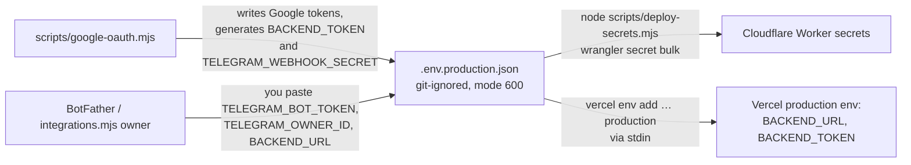

# Deployment

This page covers what gets published where, in what order, the exact commands, how to check a deploy worked, and how to roll it back. First-time provisioning (creating the database, the bot, and the OAuth client) is in [SETUP.md](SETUP.md). This page is for redeploying something that already exists.

There is **no CI/CD**. Deploys are run by hand from a developer machine. The two runbooks in [`.claude/skills/deploy-backend`](../.claude/skills/deploy-backend/SKILL.md) and [`.claude/skills/deploy-website`](../.claude/skills/deploy-website/SKILL.md) are the canonical step lists: a human can follow them, and so can an agent asked to "deploy the backend". This page summarises them and explains why each step is there.

## What goes where

| Unit | Target | Command | Config |
|---|---|---|---|
| Database schema | Cloudflare D1 `expenses` | `npm run db:migrate:remote` | `backend/migrations/`, `[[d1_databases]]` in `backend/wrangler.toml` |
| Backend Worker | Cloudflare Worker `personal-expenses` (cron `*/5 * * * *`) | `npm run deploy:backend` | [`backend/wrangler.toml`](../backend/wrangler.toml) |
| Worker secrets | Worker `personal-expenses` | `node scripts/deploy-secrets.mjs` | local `.env.production.json` (git-ignored) |
| Website | Vercel project `spartak5/personal-expenses` | `npx vercel --prod` from `website/` | [`website/vercel.json`](../website/vercel.json), `website/.vercel/project.json` (git-ignored link) |

The live URLs are https://personal-expenses.oybek-expenses-4801.workers.dev (backend) and https://personal-expenses-liard-chi.vercel.app (dashboard).

The deploys are independent of each other. Deploying the website doesn't touch the backend, and the reverse is also true.

## Order when a change spans layers

```
1. D1 migration    →   2. Backend Worker   →   3. Website
```

- **Migrations go first**, so new code never runs against an old schema. Migrations must be **additive** so the *old* Worker keeps working in the minutes before the new one is deployed. Also, a Worker rollback does **not** roll back D1.
- **The backend goes before the website**, so the dashboard never calls an API that doesn't exist yet.
- If the website needs a new route, the proxy allowlist is part of the website deploy (see [frontend.md](frontend.md#adding-a-new-dashboard-endpoint)).

## Before any deploy

```sh
npm test         # all tests must pass
npm run build    # typecheck + Worker dry-run bundle + website build + validate
```

Don't run these two in parallel. Don't deploy if either one fails.

## Deploying the backend

```sh
npx wrangler whoami                                                    # logged in? otherwise: npx wrangler login
npx wrangler d1 migrations list expenses --remote --config backend/wrangler.toml
npm run db:migrate:remote        # only if migrations are pending, and only after reviewing them
npm run deploy:backend
```

The deploy output should show the Worker URL, `schedule: */5 * * * *` and a **Current Version ID**. Write the version ID down.

**Smoke checks.** These are anonymous and read-only. Never send tokens or edit live data.

```sh
B=https://personal-expenses.oybek-expenses-4801.workers.dev
curl -s -o /dev/null -w '%{http_code}\n' $B/api/expenses        # 401
curl -s -o /dev/null -w '%{http_code}\n' $B/telegram/webhook    # 405 (GET)
curl -s -o /dev/null -w '%{http_code}\n' $B/about               # 200
curl -s -o /dev/null -w '%{http_code}\n' https://personal-expenses-liard-chi.vercel.app/api/health   # 200
```

Rules:
- Deploy only `npm run deploy:backend`. **Never deploy `backend/src/maintenance.ts`** unless you are running the mailbox switch. That Worker blocks all application traffic (see [operations.md](operations.md#the-maintenance-worker)).
- Secrets persist across deploys. Don't re-upload them as part of a code deploy.
- `wrangler login` can fail with `request_forbidden` / "No CSRF value". Sign in to the Cloudflare dashboard in your browser first, then retry.

## Deploying the website

Run these from `website/`. `--cache ../.npm-cache` works around root-owned files in `~/.npm` that break `npx` on the owner's machine. The `.npm-cache/` directory is git-ignored.

```sh
cd website
npx --yes --cache ../.npm-cache vercel whoami
npx --yes --cache ../.npm-cache vercel project inspect personal-expenses   # must show spartak5/personal-expenses
npx --yes --cache ../.npm-cache vercel --prod --yes
```

The link to the right project lives in `website/.vercel/project.json`. If it's missing, the CLI will ask you to link again. Choose the **`spartak5`** team scope (add `--scope spartak5` if needed), and never create a new project. The account username is different from the team slug, and that is expected.

Vercel runs `npm run build` (from `vercel.json`), so the deploy uses the committed `worker/` sources, not your local `dist/`. Deployment protection must stay **disabled**, because the dashboard is public by design.

**Smoke checks:**

```sh
S=https://personal-expenses-liard-chi.vercel.app
for p in / /api/expenses /api/totals /api/health; do curl -s -o /dev/null -w "%{http_code} $p\n" $S$p; done   # all 200
curl -s -o /dev/null -w '%{http_code}\n' $S/api/activate                                                    # 404
```

## Recording a deploy

After a production deploy, add a short dated section at the end of [history.md](history.md). Include what changed, the version ID or deployment hostname, the test and build results, the smoke check results, and whether migrations or secrets were touched. Update `README.md` only if what is implemented or how to run it has changed.

## Rollback

| What | How | Notes |
|---|---|---|
| Backend code | `npx wrangler rollback --config backend/wrangler.toml` | Returns to the previous Worker version. Secrets and D1 are unchanged. |
| Website | Vercel dashboard → Deployments → promote the previous production deployment | Or use `vercel rollback`. The old Sites deployment no longer exists. |
| Database | **No automatic rollback.** | Write a new forward migration. For a data disaster, use Cloudflare D1 Time Travel (point-in-time restore) from the Cloudflare dashboard or `wrangler d1 time-travel`, and only after thinking carefully, because it also discards newer transactions. |

## Secrets



- `deploy-secrets.mjs` uploads exactly seven keys and refuses to run if any of them is missing. It never prints values.
- In Vercel, `BACKEND_URL` and `BACKEND_TOKEN` exist **only in the Production environment**. Preview deployments intentionally have no backend.
- **Rotating `BACKEND_TOKEN`** means changing it in both places: update `.env.production.json`, run `deploy-secrets.mjs`, then update the Vercel variable (`vercel env rm BACKEND_TOKEN production`, then `vercel env add BACKEND_TOKEN production`) and redeploy the website so the function picks it up. The dashboard returns errors between the two steps.
- Reconnecting Gmail (for example, after `gmail_authorization_required`) means running `node scripts/google-oauth.mjs <client.json>` and then `node scripts/deploy-secrets.mjs`. No code deploy is needed. See [operations.md](operations.md).
- Never commit `.env*` files or `backend/.dev.vars`, and never paste their contents into logs, issues or chat.

## Telegram Mini App controlled rollout

`TELEGRAM_APP_URL` is optional Worker presentation configuration, separate from browser/recovery `SITE_URL` and server-only `BACKEND_URL`. An HTTPS root without userinfo, query, or fragment enables app buttons in existing notification jobs; absent or invalid values preserve browser access. No migration, OAuth exchange, session, or identity gate is part of Mini App rollout.

Build and validate first. Create a public candidate in the existing Vercel project with `npx vercel --prod --skip-domain --yes` from `website/`: this uses production server variables without promoting the stable alias. Verify anonymous browser access before advertising it. Use `node scripts/mini-app-menu.mjs capture` once, then `apply <candidate-url>` for the owner override. The helper verifies readback and retains the original protected snapshot. Test menu and a tracked disposable inline launch in Telegram Web; discard unsaved synthetic drafts or remove only identified manual test records/messages. Test email classification/receipt cleanup locally, because production receipt retention could affect older real messages. Native clients, naturally arriving receipts, and the actual 21:00 summary remain deferred checks.

Deploy a compatible backend before promoting the frontend that needs its new route. Configure the final `TELEGRAM_APP_URL` and owner menu only after candidate checks pass. Keep browser/profile/Gmail-recovery destinations on `SITE_URL`. On launch failure, run `node scripts/mini-app-menu.mjs restore` and remove/disable app configuration, then use the previous Vercel production deployment and a compatible Worker rollback as needed. Restore changes the exact captured owner override, verifies it, and leaves the default untouched. Do not reset D1, activation, Gmail progress, pending replies, outbox jobs, webhook, or updates to roll back launch presentation. Record actual versions and observations in [history.md](history.md).
