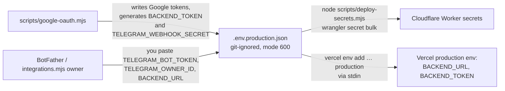

# Deployment

This page covers what gets published where, in what order, the exact commands, how to check a deploy worked, and how to roll it back. First-time provisioning (creating the database, the bot, and the OAuth client) is in [SETUP.md](SETUP.md). This page is for redeploying something that already exists.

There is **no CI/CD**. Deploys are run by hand from a developer machine. The two runbooks in [`.claude/skills/deploy-backend`](../.claude/skills/deploy-backend/SKILL.md) and [`.claude/skills/deploy-website`](../.claude/skills/deploy-website/SKILL.md) are the canonical step lists: a human can follow them, and so can an agent asked to "deploy the backend". This page summarises them and explains why each step is there.

## What goes where

| Unit            | Target                                                     | Command                             | Config                                                                                             |
| --------------- | ---------------------------------------------------------- | ----------------------------------- | -------------------------------------------------------------------------------------------------- |
| Database schema | Cloudflare D1 `expenses`                                   | `npm run db:migrate:remote`         | `backend/migrations/`, `[[d1_databases]]` in `backend/wrangler.toml`                               |
| Backend Worker  | Cloudflare Worker `personal-expenses` (cron `*/5 * * * *`) | `npm run deploy:backend`            | [`backend/wrangler.toml`](../backend/wrangler.toml)                                                |
| Worker secrets  | Worker `personal-expenses`                                 | `node scripts/deploy-secrets.mjs`   | local `.env.production.json` (git-ignored)                                                         |
| Website         | Vercel project `spartak5/personal-expenses`                | `npx vercel --prod` from `website/` | [`website/vercel.json`](../website/vercel.json), `website/.vercel/project.json` (git-ignored link) |

The live URLs are https://personal-expenses.oybek-expenses-4801.workers.dev (backend) and https://personal-expenses-liard-chi.vercel.app (dashboard).

The deploys are independent of each other. Deploying the website doesn't touch the backend, and the reverse is also true.

## Order when a change spans layers

```
1. D1 migration    →   2. Backend Worker   →   3. Website
```

- **Migrations go first**, so new code never runs against an old schema. Migrations must be **additive** so the _old_ Worker keeps working in the minutes before the new one is deployed. Also, a Worker rollback does **not** roll back D1.
- **The backend goes before the website**, so the dashboard never calls an API that doesn't exist yet.
- If the website needs a new route, the proxy allowlist is part of the website deploy (see [frontend.md](frontend.md#adding-a-new-dashboard-endpoint)).

## Before any deploy

```sh
npm test         # all tests must pass
npm run build    # typecheck + Worker dry-run bundle + website build + validate
```

Don't run these two in parallel. Don't deploy if either one fails.

## Deploying the backend

```sh
npx wrangler whoami                                                    # logged in? otherwise: npx wrangler login
npx wrangler d1 migrations list expenses --remote --config backend/wrangler.toml
npm run db:migrate:remote        # only if migrations are pending, and only after reviewing them
npm run deploy:backend
```

The deploy output should show the Worker URL, `schedule: */5 * * * *` and a **Current Version ID**. Write the version ID down.

**Smoke checks.** These are anonymous and read-only. Never send tokens or edit live data.

```sh
B=https://personal-expenses.oybek-expenses-4801.workers.dev
curl -s -o /dev/null -w '%{http_code}\n' $B/api/expenses        # 401
curl -s -o /dev/null -w '%{http_code}\n' $B/telegram/webhook    # 405 (GET)
curl -s -o /dev/null -w '%{http_code}\n' $B/about               # 200
curl -s -o /dev/null -w '%{http_code}\n' https://personal-expenses-liard-chi.vercel.app/api/health   # 200
```

Rules:

- Deploy only `npm run deploy:backend`. **Never deploy `backend/src/maintenance.ts`** unless you are running the mailbox switch. That Worker blocks all application traffic (see [operations.md](operations.md#the-maintenance-worker)).
- Secrets persist across deploys. Don't re-upload them as part of a code deploy.
- `wrangler login` can fail with `request_forbidden` / "No CSRF value". Sign in to the Cloudflare dashboard in your browser first, then retry.

## Deploying the website

Run these from `website/`. `--cache ../.npm-cache` works around root-owned files in `~/.npm` that break `npx` on the owner's machine. The `.npm-cache/` directory is git-ignored.

```sh
cd website
npx --yes --cache ../.npm-cache vercel whoami
npx --yes --cache ../.npm-cache vercel project inspect personal-expenses --scope spartak5   # must show spartak5/personal-expenses
npx --yes --cache ../.npm-cache vercel --prod --yes --scope spartak5
```

The link to the right project lives in `website/.vercel/project.json`. If it's missing, the CLI will ask you to link again. Use the **`spartak5`** team scope explicitly (`--scope spartak5`) for project inspection and deployment, and never create a new project. The account username is different from the team slug, and that is expected.

Vercel runs `npm run build` (from `vercel.json`), so the deploy uses the committed `worker/` sources, not your local `dist/`. Deployment protection must stay **disabled**, because the dashboard is public by design.

**Smoke checks:**

```sh
S=https://personal-expenses-liard-chi.vercel.app
for p in / /api/expenses /api/totals /api/health; do curl -s -o /dev/null -w "%{http_code} $p\n" $S$p; done   # all 200
curl -s -o /dev/null -w '%{http_code}\n' $S/api/activate                                                    # 404
```

## Recording a deploy

After a production deploy, add a short dated section at the end of [history.md](history.md). Include what changed, the version ID or deployment hostname, the test and build results, the smoke check results, and whether migrations or secrets were touched. Update `README.md` only if what is implemented or how to run it has changed.

## Rollback

| What         | How                                                                         | Notes                                                                                                                                                                                                                                                 |
| ------------ | --------------------------------------------------------------------------- | ----------------------------------------------------------------------------------------------------------------------------------------------------------------------------------------------------------------------------------------------------- |
| Backend code | `npx wrangler rollback --config backend/wrangler.toml`                      | Returns to the previous Worker version. Secrets and D1 are unchanged.                                                                                                                                                                                 |
| Website      | Vercel dashboard → Deployments → promote the previous production deployment | Or use `vercel rollback`. The old Sites deployment no longer exists.                                                                                                                                                                                  |
| Database     | **No automatic rollback.**                                                  | Write a new forward migration. For a data disaster, use Cloudflare D1 Time Travel (point-in-time restore) from the Cloudflare dashboard or `wrangler d1 time-travel`, and only after thinking carefully, because it also discards newer transactions. |

## Secrets



- `deploy-secrets.mjs` uploads exactly seven keys and refuses to run if any of them is missing. It never prints values.
- In Vercel, `BACKEND_URL` and `BACKEND_TOKEN` exist **only in the Production environment**. Preview deployments intentionally have no backend.
- **Rotating `BACKEND_TOKEN`** means changing it in both places: update `.env.production.json`, run `deploy-secrets.mjs`, then update the Vercel variable (`vercel env rm BACKEND_TOKEN production`, then `vercel env add BACKEND_TOKEN production`) and redeploy the website so the function picks it up. The dashboard returns errors between the two steps.
- Reconnecting Gmail (for example, after `gmail_authorization_required`) means running `node scripts/google-oauth.mjs <client.json>` and then `node scripts/deploy-secrets.mjs`. No code deploy is needed. See [operations.md](operations.md).
- Never commit `.env*` files or `backend/.dev.vars`, and never paste their contents into logs, issues or chat.

## Telegram Mini App controlled rollout

`TELEGRAM_APP_URL` is optional Worker presentation configuration, separate from browser/recovery `SITE_URL` and server-only `BACKEND_URL`. An HTTPS root without userinfo, query, or fragment enables app buttons in existing notification jobs; absent or invalid values preserve browser access. No migration, OAuth exchange, session, or identity gate is part of Mini App rollout.

Build and validate first. Create a public candidate in the existing Vercel project with `npx --yes --cache ../.npm-cache vercel --prod --skip-domain --yes --scope spartak5` from `website/`: this uses production server variables without promoting the stable alias. Verify anonymous browser access before advertising it. Use `node scripts/mini-app-menu.mjs capture` once, then `apply <candidate-url>` for the owner override. The helper verifies readback and retains the original protected snapshot. Reuse the protected original snapshot when it already exists; do not overwrite or delete it to capture the trial menu. Test menu and a tracked disposable inline launch in Telegram Web; discard unsaved synthetic drafts or remove only identified manual test records/messages. Test email classification/receipt cleanup locally, because production receipt retention could affect older real messages. Native clients, naturally arriving receipts, and the actual 21:00 summary remain deferred checks.

Deploy a compatible backend before promoting the frontend that needs its new route. Configure the final `TELEGRAM_APP_URL` and owner menu only after candidate checks pass. Keep browser/profile/Gmail-recovery destinations on `SITE_URL`. On launch failure, run `node scripts/mini-app-menu.mjs restore` and remove/disable app configuration, then use the previous Vercel production deployment and a compatible Worker rollback as needed. Restore changes the exact captured owner override, verifies it, and leaves the default untouched. Do not reset D1, activation, Gmail progress, pending replies, outbox jobs, webhook, or updates to roll back launch presentation. Record actual versions and observations in [history.md](history.md).

### Mini App cutover gates and recovery rehearsal

Before rollout, record the current Worker version and stable Vercel deployment, retain the original menu snapshot, and identify the candidate deployment. Mini App changes require no migration. Stop if unexpected pending migrations appear; do not fold them into this release. First deploy the compatible Worker **without** `TELEGRAM_APP_URL`, retaining its version as the recovery target; promote the verified frontend next, then enable Worker app-button configuration and the owner menu. `scripts/deploy-secrets.mjs` uploads integration secrets, not this optional presentation setting. Use the existing Worker `[vars]` configuration and normal backend deploy for enabling/disabling it; retain `SITE_URL`, credentials, D1 binding and cron.

| Failure point / release gate                                                                               | Recovery action                                                                                                                                                                                                       | Evidence required before continuing                                                                                                                                                                                         |
| ---------------------------------------------------------------------------------------------------------- | --------------------------------------------------------------------------------------------------------------------------------------------------------------------------------------------------------------------- | --------------------------------------------------------------------------------------------------------------------------------------------------------------------------------------------------------------------------- |
| Candidate creation, anonymous access, or automated validation fails                                        | Keep stable alias and app-button configuration unchanged. Restore the captured owner menu if a trial was applied.                                                                                                     | Candidate `/` and public APIs work without login; test/build pass. A failed trial does not authorize promotion.                                                                                                             |
| Compatible backend deploy or smoke check fails before frontend promotion                                   | Keep old frontend active. Restore the recorded pre-release Worker version if the new backend is unhealthy.                                                                                                            | Public browser reads still work; direct unauthenticated backend API is 401; public administrative route is 404; unauthenticated webhook POST is 401.                                                                        |
| Candidate single-record retrieval fails after compatible backend deploy                                    | Keep the working compatible backend and old frontend; fix/rebuild the candidate. Do not advertise transaction launch links.                                                                                           | Candidate finds an identified synthetic record by ID outside list filters; missing record is 404 and opening it makes no write.                                                                                             |
| Frontend promotion fails or browser/transaction navigation regresses                                       | Promote the recorded previous Vercel production deployment in Vercel Deployments. Keep the compatible backend, with app buttons disabled.                                                                             | Stable browser Ledger, Month and health work anonymously. Do not roll the backend back to a version without the new route while the new frontend remains advertised.                                                        |
| App-button configuration or owner menu fails, including a lost response after Telegram accepted the change | Run `node scripts/mini-app-menu.mjs restore`; disable `TELEGRAM_APP_URL` through normal backend configuration/deploy. If the UI is also broken, restore the previous Vercel deployment.                               | Menu readback matches original owner override; default menu remains unchanged. Newly delivered notifications use the ordinary browser recovery links. Already-sent app buttons are not rewritten by configuration rollback. |
| Telegram is unavailable during recovery                                                                    | Open the stable browser dashboard directly. Keep the original snapshot and retry menu restore when Telegram returns. Do not clear pending updates or outbox jobs, or re-register the webhook merely to repair launch. | Browser reads and edits remain usable independently of Telegram; failed notifications retain retry state and resume when service returns. Do not claim menu restore succeeded until readback succeeds.                      |

The synthetic rehearsal is `node --import tsx --test tests/mini-app-recovery.test.ts`. It uses one populated database with manual/email/review records, pending prompts, failed notifications, a Gmail cursor/page token, update deduplication and a lease. It disables app presentation during a Telegram outage, verifies anonymous browser reads and protected boundaries, and compares all stored rows before/after recovery reads and an idempotent manual retry. Once Telegram recovers, queued sends resume without app buttons and reversed, duplicated replies still reach their original transactions. A separate stateful menu mock accepts an apply then loses its response; restore recovers the prior owner menu. This rehearses application failure handling locally; it does **not** claim a Cloudflare or Vercel production rollback was executed.

For live continuity evidence, compare activation exactly and confirm Gmail progress has not reset; ordinary polling may legitimately advance the cursor and change pending counts during rollout. Inspect only redacted counts, identifiers and state metadata needed to account for queued jobs/pending associations, without exporting user data. Any unexpected history loss, activation change, broken public/backend boundary, association loss or persistent sync/delivery regression stops cutover and triggers the appropriate stage recovery above. Presentation rollback never uses the maintenance Worker, mailbox-switch helper, database reset, Time Travel or queue deletion. Record actual cloud versions, observed checks, expected synthetic changes and any unverified/deferred observations separately from local rehearsal evidence.

## FP-003 reimbursement release (deployed 6 October 2026)

Deployed on 6 October 2026 with this procedure; see the [history record](history.md#expense-reimbursements-fp-003-rollout--6-october-2026), including the D1 trigger-parsing incident that stalled step 4 until the migration was fixed. Synthetic live writes/messages and Telegram Web acceptance were not part of that authorization and remain pending. The implementation changes the meaning of financial reports: existing classified reimbursements stop counting as income and remain pending until named and linked. Do not infer identities or matches.

Reimbursements require a coordinated cutover, superseding the ordinary migration/backend/frontend order above for this release:

1. Record the current Worker/frontend versions, exact activation and redacted cursor/queue/association metadata. Verify the candidate test/build and local migration/recovery evidence. Preserve recovery artifacts outside source control when private.
2. Under ER-07 authorization, deploy `backend/wrangler.release-pause.toml` to the existing Worker. This dedicated entrypoint returns 503 for application/webhook calls and does no scheduled processing. `/release-status` requires the existing backend bearer credential and reports only pause state and active lease counts. It exposes no reset operation. **Never deploy the mailbox-reset `maintenance.ts` for FP-003.**
3. Confirm pause readback. Drain previous invocations before migration: allow at least 15 minutes after pause propagation for scheduled work, check provider invocation completion and ensure leases/claims have expired. Empty leases alone do not prove HTTP invocations have ended. Cloudflare documents a [15-minute scheduled-handler limit](https://developers.cloudflare.com/workers/runtime-apis/handlers/scheduled/) and [HTTP execution semantics](https://developers.cloudflare.com/workers/runtime-apis/context/); if earlier invocations cannot be accounted for, keep the release paused. Do not delete leases, queues or Telegram updates to force readiness.
4. Apply only the reviewed additive `0005_reimbursements.sql` migration. It adds payer/link fields and invariant/version triggers while preserving source records, manual request snapshots and integration state. Migration itself queues no messages.
5. Publish the verified compatible frontend while the backend remains paused, then deploy the reimbursement-aware backend to resume processing. Preserve secrets, cron, D1 binding, site URLs and bot menu configuration. Replayed Telegram updates remain deduplicated; paused webhook calls were not acknowledged.
6. Verify fresh-browser financial reads, direct unauthorized rejection, proxy/admin boundaries, sync continuity, original-history preservation, pending legacy reimbursements, and actual Telegram Web behavior. Do live writes/messages only within the explicit authorized scope, tracking and removing only exact disposable artifacts. Record actual deployment versions and observations in history.

Financial clients must send `X-Tracker-Contract: reimbursements-v1`; the public proxy forwards the caller's header unchanged. Cached older browsers receive `refresh_required` and must reload. This prevents older JavaScript from displaying raw bank amounts as personal spending.

After activation, recover with a reimbursement-aware repair release or reapply the dedicated release pause. Do not deploy pre-feature financial code, delete links, reset history, or restore an older database merely to recover presentation. The additive schema alone does not make old financial semantics compatible. Telegram outages retain jobs; a local rehearsal is not evidence of a real cloud rollback. Required Telegram Web and hosted smoke checks remain pending until observed; native clients remain deferred.
