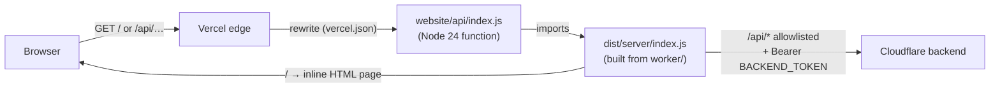

# Frontend: the public dashboard

This page explains how the website in [`website/`](../website) is built, how its proxy guards the backend, how the browser code is organised, and how to preview UI changes. There is no framework and no bundler, four source files and a small build script.

## How a request is served



- **[`vercel.json`](../website/vercel.json)** rewrites `/` and `/api/:path*` to the single function `/api/index`. `public/` holds only `robots.txt` (`Disallow: /`), and the build writes that file too.
- **[`api/index.js`](../website/api/index.js)** is the Vercel adapter. It imports the **built** `dist/server/index.js` and passes it `BACKEND_URL` and `BACKEND_TOKEN` from `process.env`. Those two variables are set only in Vercel's **production** environment.
- **[`worker/index.js`](../website/worker/index.js)** is the actual handler. It uses the standard `fetch(request, env)` Web API, so it runs the same way on Vercel, in Wrangler (`npm run dev:website`) and in the Node preview server.

## The proxy: the website's security boundary

The dashboard has no login. What protects the backend is this list of rules in `worker/index.js`:

| Rule                | Behaviour                                                                                                                                                                                                                                    |
| ------------------- | -------------------------------------------------------------------------------------------------------------------------------------------------------------------------------------------------------------------------------------------- |
| Path allowlist      | Only `^/api/(expenses(/<36 chars [a-f0-9-]>)?\|totals\|insights\|health)$` is forwarded. Everything else under `/api/` returns **404**, including `/api/activate`. The id must be **lowercase**.                                             |
| Method table        | `/api/expenses/:id` accepts PATCH only. `/api/expenses` accepts GET and POST. Everything else accepts GET only. Any other method returns **405**.                                                                                            |
| Same-origin writes  | POST and PATCH need `Origin` equal to the site's own origin **and** `Content-Type: application/json`, otherwise **403**. This blocks cross-site form posts (CSRF).                                                                           |
| Body limit          | Write bodies are limited to 8000 UTF-8 bytes (**413**).                                                                                                                                                                                      |
| Configuration check | If `BACKEND_URL` or `BACKEND_TOKEN` is missing, it returns **503** "Connect the expense service…". If `BACKEND_URL` isn't `https://`, it also returns 503.                                                                                   |
| Credential handling | It adds `Authorization: Bearer …` on the server. With `redirect: "manual"`, any 3xx from upstream is turned into a **503**, so the token is never sent to a redirect target. The timeout is 15 s.                                            |
| Responses           | The upstream status and body are passed through, always with `Cache-Control: no-store`.                                                                                                                                                      |
| Page                | `GET`/`HEAD /` returns the inline HTML with a strict CSP: `default-src 'none'`, inline script/style plus the official Telegram SDK script path, `connect-src 'self'`. It also sends `nosniff` and `no-referrer`. Any other path returns 404. |

The backend applies its own checks as well (token, validation, versions; see [backend-api.md](backend-api.md)). The proxy is an extra layer, not the only one.

### Adding a new dashboard endpoint

Change all four of these, or the call will 404 in the browser:

1. The backend route in `api()` ([`backend/src/api.ts`](../backend/src/api.ts)).
2. The **path regex** in `worker/index.js`.
3. The **method table** just below it, if it needs anything other than GET.
4. The proxy tests in [`tests/website.test.ts`](../tests/website.test.ts), which assert what is and isn't forwarded.

## The build

`npm --prefix website run build` runs `scripts/build.sh`, which calls [`scripts/build.mjs`](../website/scripts/build.mjs):

1. It reads `worker/index.js`, `worker/page.html`, `worker/client.js` and `worker/telegram.js`.
2. It replaces `__TELEGRAM_SCRIPT__` and `__CLIENT_SCRIPT__` in the HTML with the adapter and client code, then replaces the string literal `"__PAGE_DOCUMENT__"` in the handler with the whole page as a JSON string.
3. It writes the result to **`dist/server/index.js`**, which is one self-contained module, plus `public/robots.txt`.

[`scripts/validate-artifact.mjs`](../website/scripts/validate-artifact.mjs) (`npm --prefix website run validate`) imports the adapter, requests `/`, and checks that the page rendered and that no placeholder is left.

`dist/` is git-ignored. **Anything that imports `dist/` sees only the last build**: the Vercel adapter, `validate` and `npm run preview`, which rebuilds first. `tests/website.test.ts` imports the _unbuilt_ `worker/index.js`, whose page is still the placeholder, so it tests the proxy rules and not the page contents.

## Browser code: [`worker/client.js`](../website/worker/client.js)

The browser code is one plain script with module-level state (`expenses`, `nextOffset`, `params`, `selected`, `creationId`, `month`, and so on). The main functions:

| Function                                      | Does                                                                                                                                                                                                                                                                                                                                                                                                                                                                                                                                                                       |
| --------------------------------------------- | -------------------------------------------------------------------------------------------------------------------------------------------------------------------------------------------------------------------------------------------------------------------------------------------------------------------------------------------------------------------------------------------------------------------------------------------------------------------------------------------------------------------------------------------------------------------------- |
| `api(path, options)`                          | A `fetch` wrapper. It parses JSON and throws `Error(data.error)` for any non-2xx response, so backend messages appear in the UI.                                                                                                                                                                                                                                                                                                                                                                                                                                           |
| `money(minor, currency)`                      | Formats a minor-unit value with **BigInt** (it takes numbers or strings). Floating point is never used. Whole amounts drop `.00` (`12,000 UZS`), and any other fraction is shown in full (`12.99 USD`).                                                                                                                                                                                                                                                                                                                                                                    |
| `time`, `dayKey`, `dayLabel`, `clock`         | Formatting with `Intl` and `timeZone: "Asia/Tashkent"`.                                                                                                                                                                                                                                                                                                                                                                                                                                                                                                                    |
| `load(append)`                                | Fetches `/api/expenses` and `/api/health` in parallel, plus `/api/totals` only while a search or filter is active. `requestVersion` makes a newer filter change win over an in-flight load. With `append = true`, it appends the next page ("Load more").                                                                                                                                                                                                                                                                                                                  |
| `render()`, `row(e, showCard)`, `dayHeader()` | Build the ledger grouped by Tashkent day. A row has two lines: the merchant and amount, then the category, description and time. `displayName()` title-cases bank capitals and drops a trailing `UZ` for display only. UZS amounts go unmarked, and other currencies show their code. The card suffix appears only when the loaded rows include more than one card. A day header shows the exact spending total per currency when the day has two or more spends, except for the last day before **Load more**, which may be partial. Tapping a row calls `openEditor(e)`. |
| `renderTotals(totals)`                        | Shows one quiet **Filtered** line with Spending and Income per currency (UZS first, other currencies marked). It is hidden when there are no filters. Net cash flow per currency lives in the Month view.                                                                                                                                                                                                                                                                                                                                                                  |
| `syncStatus(text, state, at)`                 | Updates the full sync line `#sync` and the phone top-bar button `#sync-mini` (a status dot plus a short time, with the full text as its accessible name). It sets `body[data-sync]`, so phones show the full line only for `warn`, `down` or `off`.                                                                                                                                                                                                                                                                                                                        |
| `form.onsubmit` / `form.onchange`             | Turn the filter form into `params`. Toggles and pickers apply immediately, and search applies on Enter.                                                                                                                                                                                                                                                                                                                                                                                                                                                                    |
| `openEditor(e)`                               | Opens the `<dialog id="editor">`. With `e = null` it is the **Add transaction** form, and `creationId = crypto.randomUUID()` is generated once per open form. It shows review fields for review items and all fields for manual rows.                                                                                                                                                                                                                                                                                                                                      |
| `save(dismiss)`                               | Builds the PATCH or POST body (`version`, category, description, plus the manual or `resolve` fields) and sends it, then reloads. A retry from the same open form reuses `creationId`, which is what makes manual creation idempotent.                                                                                                                                                                                                                                                                                                                                     |
| `localInput(iso)` / `apiLocalTime(input)`     | Convert between UTC ISO and the `<input type="datetime-local">` value in Tashkent time, then to the backend's `dd.mm.yy HH:MM` format.                                                                                                                                                                                                                                                                                                                                                                                                                                     |
| `route()`                                     | A hash router. `#month` shows the Month view, and anything else shows the ledger.                                                                                                                                                                                                                                                                                                                                                                                                                                                                                          |
| `loadMonth()`, `renderMonth()`                | Fetch `/api/insights?month=` and draw the month totals, the calendar heatmap, the per-day table and the category strip.                                                                                                                                                                                                                                                                                                                                                                                                                                                    |
| `showLedger(filters)`                         | Jumps from the Month view to the ledger with filters for a day or a category.                                                                                                                                                                                                                                                                                                                                                                                                                                                                                              |

## Markup and styles: [`worker/page.html`](../website/worker/page.html)

All CSS is in a `<style>` block at the top (dark-first, with light-mode tokens). The body contains:

- `header.bar`: the brand, the phone-only `#sync-mini` (tap to refresh) and `#filter-toggle` (opens `#more-filters`; a dot means a search, date or category filter is active; hidden in the Month view), and `.dock` with the Ledger/Month switch (`#to-ledger`, `#to-month`) and `#add-transaction`. Below 640px, `.dock` becomes a fixed bottom bar: Ledger and Month as tabs with a round **+** between them, padded for the safe area. From 640px up it stays in the header as before.
- `main#ledger-view`: sync status `#sync`, the filter form `#filters` (All/Income/Spending and Needs details, then a collapsible search, date and category section that opens when a search is active; on phones its summary row is hidden and `#filter-toggle` opens it), the filtered totals `#totals`, the list `#rows` and `#more`.
- `main#month-view`: month navigation, `#month-totals`, the calendar `#cal` with its `#readout`, an accessible `#day-table`, and the categories `#cat-strip` and `#cats`.
- `dialog#editor`: the edit and create form, with `#review-fields`, `#form-error` and `#dismiss`.
- `#toast`.

## Previewing UI changes

```sh
npm run preview      # builds, then serves http://127.0.0.1:8788
```

[`scripts/preview.ts`](../scripts/preview.ts) builds an in-memory database with `setup()` from the test helpers and fills it with synthetic transactions: spending spread over a month, income, and one review item. It **replaces `fetch`** so that only the fake backend is reachable, then serves the real built handler. Nothing leaves your machine, and restarting resets the data.

The [`design-ui` skill](../.claude/skills/design-ui/SKILL.md) records the UI conventions (dark-first, calm, phone-first). It also includes a headless-Chrome screenshot script. Save screenshots under [`docs/screenshots/`](screenshots).

`npm run dev:website` also uses port 8788. It serves the built handler in Wrangler with no backend configured, so `/api/*` returns 503. Use it only to check the Worker runtime, and don't run it at the same time as `preview`.

## Telegram presentation boundary

[`worker/telegram.js`](../website/worker/telegram.js) adapts the shared public dashboard to a Telegram host. The official SDK loads asynchronously from `https://telegram.org/js/telegram-web-app.js?63`; page CSP permits only that additional script path. Ordinary API requests and browser startup never wait for the SDK. A missing SDK, a failed download, or the SDK's ordinary-browser `unknown` platform leaves the browser dashboard available. The adapter does not read, send, log, or persist Telegram identity or `initData`.

When a host is present, the adapter calls supported startup controls and listens for theme, viewport, and safe-area events. Telegram light/dark selection overrides the OS theme, with validated hexadecimal presentation colors. Browser visual viewport resize provides a fallback for the editor's usable height; inset values avoid overlapping host chrome. Back closes the editor first, then returns Month to Ledger, and hides at the root. In-page navigation and Save/Cancel remain available when host capabilities are absent or throw. Native Telegram mobile clients remain unverified; browser widths do not establish native keyboard behavior.

Changed forms show an accessible inline Keep editing/Discard changes confirmation through Cancel, Escape, or host Back. Uncertain saves instead offer Leave form with a warning to check the Ledger; review dismissal uses the same inline confirmation. No browser confirm modal is needed inside Telegram's embedded frame. Dirty forms and saves in progress enable supported Telegram closing confirmation and the browser unload guard. Financial drafts stay in memory rather than browser storage; deliberately closing the app can discard them.

The API helper retains response status and bounds browser requests at 20 seconds, so a stalled write returns to uncertain-save recovery. A known validation rejection leaves editable input. After an uncertain write, the editor freezes the exact request body (including the original manual request ID and edit version) and exposes **Retry same save**. Disabled form fields remain excluded from native validation so that the retry can submit. A conflict keeps the draft and blocks blind stale retries; until bounded single-record retrieval is implemented, close the form and explicitly refresh the Ledger before reopening its latest transaction. Opening a fresh manual form creates a fresh transaction ID, so the uncertain-save exit prompt asks the user to check the Ledger first.

[`tests/mini-app-client.test.ts`](../tests/mini-app-client.test.ts) runs the actual adapter and editor functions in VM fixtures, covering missing/late hosts, capability failures, theme/resize, Back/dirty guards, frozen lost-response retries, validation correction, and conflict retention. These synthetic checks do not claim real Telegram launch support; the MA-05/MA-07 client gate records that separately.
