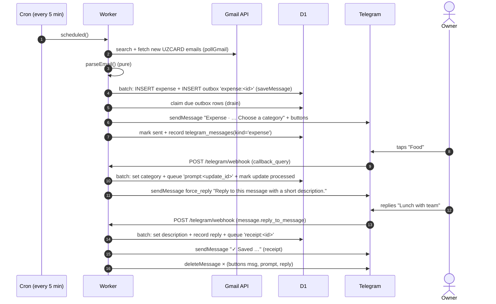

# Transaction lifecycle

This page follows one card payment from the bank's email to a completed, categorised row on the dashboard, and names the function responsible at each step. If you only read one page in depth, read this one.

## The whole journey



Each step is explained below in order.

---

## 1. The cron tick

`scheduled()` in [`backend/src/index.ts`](../backend/src/index.ts) runs every five minutes (`crons = ["*/5 * * * *"]` in [`backend/wrangler.toml`](../backend/wrangler.toml)):

```ts
await Promise.allSettled([pollGmail(env), reminder(env, event.scheduledTime)]);
await deliver(env);
```

`allSettled` means a failure in Gmail polling never blocks reminders or Telegram delivery.

## 2. Polling Gmail: `pollGmail()` in [`gmail.ts`](../backend/src/gmail.ts)

1. **Lock.** It takes a lease lock named `gmail` for 240 s through `lock()` in [`store.ts`](../backend/src/store.ts), so two overlapping runs can't process the same page. The lock is released in `finally`.
2. **Activation check.** If the `sync_state` row doesn't exist, it returns immediately. That row is created only by `POST /api/activate`. This is the guard against accidentally importing old email.
3. **Access token.** `accessToken()` exchanges `GOOGLE_REFRESH_TOKEN` for a short-lived token on every run.
4. **A fixed time window.** On the first page of a run, `window_end = now` is saved. Later pages, which may come in later cron runs, reuse that same end, so pagination stays stable.
5. **The search query:**
   ```
   from:noreply@info.uzcard.uz subject:"UZCARD INFO"
   after:<max(activated_at, cursor_at − 2s) in seconds − 1>  before:<window_end in seconds>
   ```
   `maxResults=25` and `includeSpamTrash=true`. Gmail search works in whole seconds, so the window starts about 2 s before the previous cursor. Messages that fall into the overlap are skipped because they are already stored.
6. **Per message** (in groups of 5):
   - If an expense with this `source_message_id` already exists, skip it without downloading it.
   - Otherwise download it with `format=full`, then check in code that it arrived after activation, arrived before `window_end`, and has the exact sender and subject (`matches()` in `parser.ts`).
   - Parse it, then save it with `saveMessage()`.
7. **Checkpoint.** If there is a `nextPageToken`, store only that. The next cron run continues from it. On the last page, set `cursor_at = window_end`, clear the page token, and set `last_success`.
   - **One page (at most 25 emails) is processed per run.** A backlog therefore drains at about 25 emails every 5 minutes.
   - If any message on the page fails, the page is *not* checkpointed and is retried next run. Messages that were already saved are skipped by the dedup check.
8. **Errors** are written to `sync_state.error` and shown on the dashboard:

   | Code | Meaning |
   |---|---|
   | `gmail_authorization_required` | The refresh token is revoked or expired. One `auth` outbox row is also queued, so the owner gets a single "Gmail authorization needs attention" Telegram message per outage (`auth_alerted` flag). |
   | `gmail_invalid_cursor` | Gmail returned HTTP 400 (for any request, including a message download). The page token is cleared and the page restarts on the next run. |
   | `gmail_unavailable` | Network error, timeout (10 s), or another HTTP error. The next run retries. |
   | `gmail_invalid_message`, `gmail_sync_failed` | Unexpected data. The next run retries. |

## 3. Parsing: `parseEmail()` in [`parser.ts`](../backend/src/parser.ts)

`parseEmail()` is a pure function with no I/O, which is why most of its tests need no mocks. It either returns a transaction or `{ review_reason }`.

- **Body extraction** (`bodyText()`): it walks the MIME tree and ignores attachments. If a multipart has `text/plain` children, it uses only those. Otherwise it recurses, so HTML-only mail still works. HTML is stripped of tags and `<script>`/`<style>`, and entities are decoded with the `he` library. Any part larger than 200,000 characters is rejected.
- **Line format.** Every line that contains `karta *` or `summa:` must match one strict pattern, for example:
  ```
  E-Com oplata: SAMPLE TAXI, 22.09.26 19:44, karta ***1234. summa:30500.00 UZS, balans:…
  ```
  The shape is: operation, merchant, `dd.mm.yy HH:MM[:SS]`, card suffix, amount with exactly two decimals, and currency. Optional commas are accepted in several places. **The balance is matched and thrown away.**
- **Operations:**

  | Label in email | Stored as |
  |---|---|
  | `oplata`, `E-Com oplata`, `Pokupka` (purchases) | expense |
  | `Platezh` (outgoing card-to-card transfer) | expense |
  | `Perevod na kartu` (incoming transfer) | **income** |
  | anything else | review item `unsupported_operation` |

- **Currencies:** UZS, USD, EUR and RUB are accepted, each with 2 minor digits. Anything else becomes `unsupported_currency`.
- **Bilingual copies.** Each UZCARD email repeats the same line in Uzbek and in Russian. All parsed lines must be identical, or the email becomes a `conflicting_transactions` review item. Two identical copies count as **one** transaction.
- **Money and time** use helpers in [`domain.ts`](../backend/src/domain.ts):
  - `money("30500.00")` returns `3050000`, computed with BigInt and range-checked. Zero or negative amounts are rejected.
  - `localDateTime("22.09.26 19:44")` reads the value as `+05:00` and returns a UTC ISO string. It rejects impossible dates such as 31 February.

**Review items** are emails the parser won't guess about. They are saved with all transaction fields empty and a `review_reason`. They appear in the list but are **excluded from all totals** until the owner either types in the fields on the dashboard ("resolve") or dismisses them. The owner also gets a Telegram notice about them.

## 4. Saving: `saveMessage()` in [`store.ts`](../backend/src/store.ts)

One atomic `DB.batch()` runs two statements:

1. `INSERT OR IGNORE INTO expenses …`. The UNIQUE `source_message_id` makes a replayed email a no-op.
2. `INSERT OR IGNORE INTO outbox (id='expense:'||<id of the row that exists>, kind='expense' or 'review')`.

Because both writes are in one batch, there is never a transaction with no notification job, or a notification job with no transaction. This is the **transactional outbox** pattern.

## 5. Delivering notifications: `deliver()` and `drain()` in [`telegram.ts`](../backend/src/telegram.ts)

`deliver()` runs at the end of every cron tick and after every webhook call:

```
queueCleanup → drain(all kinds) → queueCleanup → drain(delete only)
```

`drain()` picks up to 15 outbox rows where `sent_at IS NULL`, the row is due (`available_at <= now`), and it is not leased. Each row is claimed with a 60 s lease and a random token, so concurrent runs can't send the same row twice. Then it acts according to `kind`:

| Kind | Sends | Notes |
|---|---|---|
| `expense` | Summary plus "Choose a category", with inline buttons (`cat:<uuid>:<n>` or `inc:<uuid>:<n>`) | Records `telegram_messages(kind='expense')`; View transaction row when configured |
| `review` | "An UZCARD email needs review (<reason>). It is excluded from spending totals." plus the dashboard link | |
| `prompt` | Summary plus "Reply to this message with a short description." as a `force_reply` | Skipped if the transaction is already complete. Records `kind='prompt'` |
| `receipt` | "✓ Saved", summary, category · description, and the dashboard link. App launch button when configured, otherwise removes the keyboard | Only if complete. Records `kind='receipt'` |
| `reminder` | Today’s spending so far and expense count per currency, outstanding needs-details count when nonzero, and dashboard link | Sent if today has spending or outstanding details exist, and the row belongs to today |
| `auth` | "Gmail authorization needs attention. Reconnect Google…" | |
| `delete` | `deleteMessage` | See cleanup below |

Optional `TELEGRAM_APP_URL` adds a **View transaction** inline row to category notifications, reviews, and receipts. URL construction uses the validated HTTPS root and adds only `?transaction=<canonical lowercase UUID>`. Daily summaries retain a generic **Open tracker** button. The URL validator requires an HTTPS root without credentials, query, or fragment; missing/invalid configuration omits the row. Existing category callback rows and ForceReply prompts remain unchanged. Each message uses one markup type: a configured receipt uses an inline keyboard, while its prompt retains ForceReply. ForceReply ends when the owner replies, so that receipt does not also send `remove_keyboard`; without a configured app URL the receipt still sends `remove_keyboard`. Browser links and Gmail recovery continue using `SITE_URL`. Launch buttons do not queue extra jobs or alter transaction/reply associations.

- **On success,** the row is marked sent and the Telegram `message_id` is linked to the transaction in `telegram_messages`, all in one batch. That link is how replies are matched later.
- **On failure,** the retry delay is `max(min(1 h, 30 s × 2^min(attempts, 7)), Telegram's retry_after)`. That gives 30 s, 1 m, 2 m and so on, capped at one hour. **There is no maximum attempt count.**
- **Duplicate messages.** If Telegram accepts a message but the response times out, the row is retried and the owner may see the message twice. That can never create a second transaction.

## 6. The owner answers on Telegram: `handleUpdate()` in [`telegram.ts`](../backend/src/telegram.ts)

The webhook in [`index.ts`](../backend/src/index.ts) checks the secret header (401 if it's wrong) and runs `ownerUpdate()`: the chat must be private, and both the chat and the sender must be `TELEGRAM_OWNER_ID`, otherwise 403. Then it calls `handleUpdate()` and afterwards `deliver()`.

**Deduplication.** Telegram may resend an update. Every write in `handleUpdate` carries the guard `NOT EXISTS (SELECT 1 FROM telegram_updates WHERE id=?)`, and the last statement in the batch records the update ID. A resent update therefore changes nothing.

**Category button** (`callback_query`):
- The button's data must be `cat:<uuid>:<0-7>` or `inc:<uuid>:<0-2>`.
- The message the button belongs to must be *the* `expense` message recorded for that same transaction, not yet deleted, with no receipt sent yet.
- The prefix must match the transaction's direction, and the item must not be a review item or dismissed.
- The batch then sets the category and queues either `prompt:<update_id>` (no description yet) or `receipt:<id>` (a description already exists, for example one added on the website).

**Description reply** (`message` with `reply_to_message`):
- Text of 1–500 characters.
- **The replied-to message ID must be a recorded `prompt` message.** That ID identifies which transaction the reply belongs to. This is why several transactions arriving at once can be answered in any order without mix-ups.
- The batch sets the description, records the owner's reply as `kind='description'` (so it can be deleted later), and queues `receipt:<id>` once the transaction is complete.

Invalid or stale input, such as a tap on an old button or a reply to the wrong message, is marked processed and otherwise ignored.

**Dashboard edits alongside chat.** Before a receipt is delivered, recorded category buttons and prompts remain valid even when the dashboard has supplied details. The next accepted field update wins and increments `version`; dashboard saves with an earlier version return 409. Reversed replies still use their individual prompt IDs, including when expense and income transactions overlap. A queued receipt retry reads the current row, so edits made before retry appear in the receipt. Once a receipt association exists, category callbacks and description replies are stale and ignored, even before cleanup succeeds or after the dashboard reopens the row. Reopening also postpones pending cleanup until the transaction is complete again. Dashboard edits themselves do not queue a replacement receipt or a fresh chat prompt.

## 7. Chat cleanup: `queueCleanup()` in [`telegram.ts`](../backend/src/telegram.ts)

Once a transaction is complete **and its receipt was delivered**, `delete:<message_id>` jobs are queued for the category message, the prompt and the owner's reply. Receipts themselves are deleted when they are older than 47 hours, or when they are not among the **3 newest receipts**. Telegram only lets bots delete messages younger than 48 hours. A message Telegram refuses to delete is marked `cleanup_status='unavailable'` and never retried. Pending transactions' prompts are never deleted.

## 8. The 21:00 daily summary: `reminder()` in [`telegram.ts`](../backend/src/telegram.ts)

During the 21:00–21:59 Tashkent hour, each cron tick tries `INSERT OR IGNORE` of outbox row `reminder:<YYYY-MM-DD>` if today has spending or any non-dismissed transaction still needs details. The ID guarantees at most one job per day. Delivery and retries read current values; jobs expire after their local date changes. If the service is down for the entire scheduling hour, that day's summary is skipped.

Spending uses transaction times from Tashkent midnight through message generation. Include email and manual expenses, even with missing details; exclude income, dismissed records, and unresolved reviews. Sum minor units using BigInt, with one amount and expense count per currency. The outstanding count covers all dates, income, and review items. When only outstanding details trigger delivery, show “No spending recorded today.” This change was deployed on 30 September 2026.

## 9. The dashboard

The browser loads `/` from Vercel and calls `/api/expenses`, `/api/totals`, `/api/health` and `/api/insights`. The Vercel function forwards these to the backend with the token. Editing a row sends `PATCH /api/expenses/:id` with the row's `version`. If someone else changed it meanwhile, the backend returns **409** and the page asks the user to reload. See [frontend.md](frontend.md) and [backend-api.md](backend-api.md).

Transaction links select a strict UUID through `?transaction=<UUID>`. The client fetches `GET /api/expenses/:id`, which returns one current record independently of filters, month, or loaded pages. This authenticated backend route is also available through the public proxy. Opening twice only reads; it does not edit the record, create outbox work, or touch pending chat prompts. Missing or dismissed records return 404, malformed paths are rejected, and service failures remain retryable. This preserves the same shared public dashboard access policy.

A transaction **needs details** (the `NEEDS_DETAILS` SQL in [`domain.ts`](../backend/src/domain.ts)) if it is a review item, has an empty description, or is missing the category for its direction.

## 10. Manual entries

**Add transaction** on the dashboard sends `POST /api/expenses`:
1. The browser generates a UUID (`crypto.randomUUID()`) when the form opens. That UUID is both the **request ID** and the row's primary key.
2. `manualDetails()` in [`manual.ts`](../backend/src/manual.ts) validates every field:
   - merchant, 1–250 characters
   - amount with 0–2 decimals
   - one of the 4 currencies
   - Tashkent time from 2000 up to now
   - a category that matches the direction
   - a description, which is required
   - a card suffix, which is optional
3. `saveManual()` in [`store.ts`](../backend/src/store.ts) runs `INSERT … ON CONFLICT(id) DO NOTHING` and stores a JSON snapshot of the validated request in `manual_request`.
   - A retried save with the same ID and the same details returns the existing row (200 instead of 201).
   - The same ID with different details returns **409**.
4. Manual rows have `source='manual'` and no Gmail ID. They never trigger per-transaction Telegram messages and are complete as soon as they are created; their spending contributes to the daily summary.

Manual rows count in totals and insights like any other row. Rows dated before activation are shown with an "incomplete history" note and are left out of the Month view's daily average. Manual rows are never matched or merged with a later email for the same purchase.

## Reimbursement completion (FP-003, deployed 6 October 2026)

After classifying incoming money as Reimbursement, Telegram offers **Link to expense** with the transaction selector (Mini App when configured, otherwise browser). It does not require a generic description reply. Completion requires a resolved incoming reimbursement, a trimmed nonblank payer name and one eligible expense link; the note is optional. Ordinary transactions keep their category/description completion rule.

Dashboard POST/PATCH commits the guarded transaction update and eligible email receipt intent in one D1 batch. The relationship triggers check parent eligibility, currency, chronology and capacity and increment affected parent versions. Manual transactions never queue per-transaction receipts. Historical migration creates no names, matches or messages. A durable `telegram_messages` receipt association prevents replacement receipts after corrections, even if the repayment is subsequently unlinked.

Delivery rechecks current state after acquiring a transaction-level receipt lease shared by legacy and current receipt jobs. Incomplete, undelivered email jobs stay pending for retry, preserving a concurrent completion's intent. Already-delivered jobs finish without another send. Legacy description-reply associations are retained before coalescing jobs so cleanup still finds the original reply. Receipt delivery ambiguity retains the existing possible duplicate-message limitation; cleanup retries are independent of sending.

Old description replies cannot complete reimbursements. Category callbacks guard the current version and unlinked state; a losing concurrent update neither consumes the update ID nor enqueues side effects. The update ID is left unrecorded on purpose, so Telegram's redelivery of the same tap can retry against the new version and succeed. Choosing a category other than Reimbursement clears any stored payer name in the same UPDATE. Duplicated/reversed ordinary replies retain their existing transaction-specific associations. The daily summary uses the shared adjusted spending projection, deducting at the original expense date. A fully reimbursed expense (cost reduced to zero) neither triggers the summary nor adds to the expense count, while a partly reimbursed one counts once at its adjusted amount. Pending repayments add to outstanding details and never to income. Summary refresh/retry/expiry rules remain unchanged.
