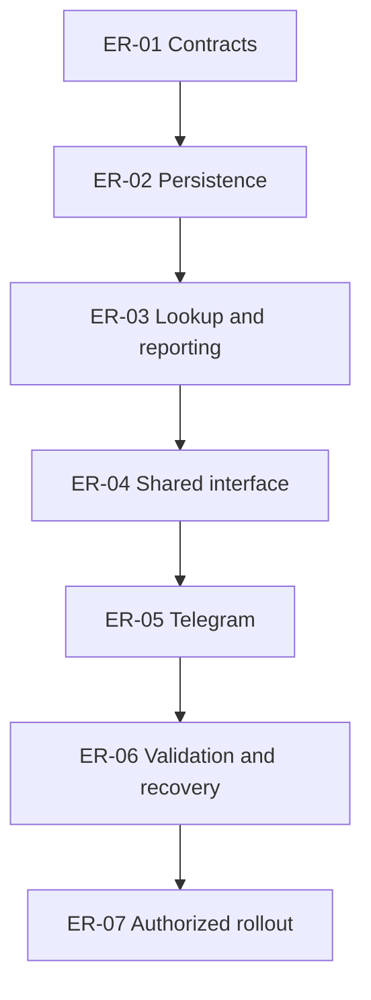

# Expense reimbursement tickets

- **Proposal status:** In progress — authorized 3 October 2026
- **Ticket status:** See [orchestration record](ORCHESTRATION.md) for implementation and delivery state.
- **Proposal:** [Expense reimbursements](PLAN.md)
- **Risks:** [Risk register](RISKS.md)

The owner authorized ER-01–ER-06 implementation on 3 October 2026. ER-07 production work remains separately gated. Dependencies are completion prerequisites; transitive edges are omitted. Keep this index, graph, and individual metadata consistent.

## Ordered ticket index

| ID | Ticket | Status | Depends on |
| --- | --- | --- | --- |
| [ER-01](tickets/ER-01-contracts.md) | Scope promotion and implementation contracts | Done | — |
| [ER-02](tickets/ER-02-persistence.md) | Reimbursement persistence and atomic mutations | Done | [ER-01](tickets/ER-01-contracts.md) |
| [ER-03](tickets/ER-03-reporting.md) | Candidate lookup and consistent personal-spending reports | Done | [ER-02](tickets/ER-02-persistence.md) |
| [ER-04](tickets/ER-04-interface.md) | Shared picker, payer entry, and expense details | In progress: Telegram Web pending | [ER-03](tickets/ER-03-reporting.md) |
| [ER-05](tickets/ER-05-telegram.md) | Telegram linking, completion, and daily summaries | Verified locally | [ER-04](tickets/ER-04-interface.md) |
| [ER-06](tickets/ER-06-validation.md) | Integrated validation and recovery rehearsal | In progress: Telegram Web pending | [ER-05](tickets/ER-05-telegram.md) |
| [ER-07](tickets/ER-07-rollout.md) | Separately authorized production rollout | Blocked: authorization | [ER-06](tickets/ER-06-validation.md) |

## Dependency graph

Arrows mean **prerequisite → dependent ticket**. The table is the text alternative.

## Release gates

1. Explicitly schedule this proposal before ER-01 implementation work. Reconcile the accepted behavior with the root agreement; documentation creation alone does not schedule it.
2. ER-01 settles the listed implementation contracts while preserving the accepted product choices. It must address current access policy and any changes since this proposal was written.
3. Record evidence before marking each ticket Done. No guessed results, checked-but-unrun tests, or automatic migration of names/matches.
4. ER-06 proves migration preservation, concurrent capacity enforcement, exact cross-month reporting, notification integrity, and recovery on synthetic data. All correctness or data-preservation blockers must be resolved.
5. ER-07 requires explicit production authorization, including the scope of any real-bot messages or synthetic live writes. Apply only the rehearsed release sequence and preserve existing history.
6. Update current-behavior docs with implementation. Append actual deployments to docs/history.md, and put only unfinished acceptance observations in next_steps.md. Keep deferred client/live observations distinct from passes.

## Evidence convention

Use Backlog, Ready, In progress, Blocked, or Done. Keep unperformed checks unchecked. Record change references, commands, outcomes, client capabilities, and remaining limitations. Use synthetic or redacted examples; never include full emails, credentials, balances, private user identifiers, or production exports.
