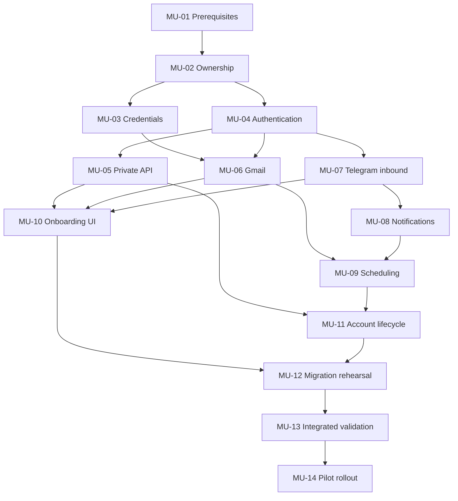

# Multi-user pilot tickets

- **Proposal status:** Planned / not scheduled
- **Ticket status:** All Backlog
- **Proposal:** [Private multi-user pilot](PLAN.md)
- **Risks:** [Risk register](RISKS.md)

These are local Markdown tickets for future work, not external issues or active assignments. Each is independently reviewable after its prerequisites are complete. No implementation or deployment has been scheduled by creating this backlog.

## Ordered ticket index

| ID | Ticket | Status | Depends on |
| --- | --- | --- | --- |
| [MU-01](tickets/MU-01-pilot-prerequisites.md) | Pilot prerequisites and contracts | Backlog | — |
| [MU-02](tickets/MU-02-user-ownership.md) | User ownership and persistence | Backlog | [MU-01](tickets/MU-01-pilot-prerequisites.md) |
| [MU-03](tickets/MU-03-credential-storage.md) | Credential storage | Backlog | [MU-02](tickets/MU-02-user-ownership.md) |
| [MU-04](tickets/MU-04-authentication-invitations.md) | Authentication and invitations | Backlog | [MU-02](tickets/MU-02-user-ownership.md) |
| [MU-05](tickets/MU-05-private-api-proxy.md) | Private backend and website proxy | Backlog | [MU-04](tickets/MU-04-authentication-invitations.md) |
| [MU-06](tickets/MU-06-gmail-integration.md) | Per-user Gmail integration | Backlog | [MU-03](tickets/MU-03-credential-storage.md), [MU-04](tickets/MU-04-authentication-invitations.md) |
| [MU-07](tickets/MU-07-telegram-linking.md) | Telegram linking and inbound handling | Backlog | [MU-04](tickets/MU-04-authentication-invitations.md) |
| [MU-08](tickets/MU-08-notification-delivery.md) | Per-user notification delivery | Backlog | [MU-07](tickets/MU-07-telegram-linking.md) |
| [MU-09](tickets/MU-09-fair-scheduling.md) | Fair background scheduling | Backlog | [MU-06](tickets/MU-06-gmail-integration.md), [MU-08](tickets/MU-08-notification-delivery.md) |
| [MU-10](tickets/MU-10-onboarding-interface.md) | Onboarding and account interface | Backlog | [MU-05](tickets/MU-05-private-api-proxy.md), [MU-06](tickets/MU-06-gmail-integration.md), [MU-07](tickets/MU-07-telegram-linking.md) |
| [MU-11](tickets/MU-11-account-lifecycle.md) | Account lifecycle | Backlog | [MU-05](tickets/MU-05-private-api-proxy.md), [MU-09](tickets/MU-09-fair-scheduling.md) |
| [MU-12](tickets/MU-12-owner-migration.md) | Owner migration and recovery rehearsal | Backlog | [MU-10](tickets/MU-10-onboarding-interface.md), [MU-11](tickets/MU-11-account-lifecycle.md) |
| [MU-13](tickets/MU-13-integrated-validation.md) | Integrated isolation and reliability validation | Backlog | [MU-12](tickets/MU-12-owner-migration.md) |
| [MU-14](tickets/MU-14-pilot-rollout.md) | Controlled pilot rollout | Backlog | [MU-13](tickets/MU-13-integrated-validation.md) |

Dependencies are completion prerequisites, not merely recommended reading. Transitive prerequisites are omitted from the table. The index, individual ticket metadata, and graph must always describe the same directed acyclic graph.

## Dependency graph

Arrows mean **prerequisite → dependent ticket**.

The table provides a text alternative when a Markdown viewer cannot render Mermaid.

## Parallel work opportunities

These describe potential future work allocation; no agents, tasks, or external issues are created by this document.

- After **MU-02**, **MU-03** (credentials) and **MU-04** (authentication) can proceed independently against the agreed ownership contract.
- After **MU-04**, **MU-05** (private API) and **MU-07** (Telegram linking) can proceed independently. **MU-06** (Gmail) can join them once **MU-03** is also complete.
- After **MU-07**, **MU-08** (notifications) can proceed while API/Gmail/UI work continues, subject to each ticket's prerequisites.
- After **MU-05**, **MU-06**, and **MU-07**, **MU-10** (onboarding UI) can proceed alongside **MU-09** (scheduling), once **MU-08** also permits scheduling work.
- **MU-11** (lifecycle) waits for **MU-05** and **MU-09**; it can proceed alongside unfinished **MU-10** work. **MU-12** joins both branches.
- **MU-12 → MU-13 → MU-14** is the final migration-rehearsal, integrated-validation, and rollout sequence.

Parallel eligibility does not guarantee conflict-free edits. Several tickets touch the same Worker entry point, shared types, persistence, or Telegram module. Coordinate those contracts and split changes into reviewable commits; use isolated branches/previews when implementing. Do not assume a partially completed branch can be deployed.

## Review and release gates

1. **Before implementation:** schedule the proposal and reconcile accepted scope with the root [PLAN.md](../../PLAN.md). Complete MU-01's contracts and record external blockers.
2. **Per ticket:** meet its acceptance checks, run relevant tests, and record actual evidence. A dependency is not complete because its code exists without validation.
3. **Before production:** complete MU-12's migration/recovery rehearsal and MU-13's integrated checks. Feature work and synthetic tests do not change the current public deployment.
4. **During MU-14:** apply the coordinated release; prove private owner access and preserved history before admitting two participants. Expand only after live acceptance.
5. **On completion:** update ticket and proposal statuses with evidence and change deployed-behavior documentation only when it is true.

## Status and evidence convention

Use **Backlog**, **Ready**, **In progress**, **Blocked**, and **Done**. Backlog is the initial state for every ticket here. Record the implementation/deployment reference, checks run, results, unresolved limitations, and any external gate. Keep live acceptance separate from automated evidence.

Do not paste real emails, tokens, account balances, private identifiers, or database exports into completion notes. Use synthetic fixtures or redacted summaries. Mark unobserved live checks as pending rather than inferring success.
