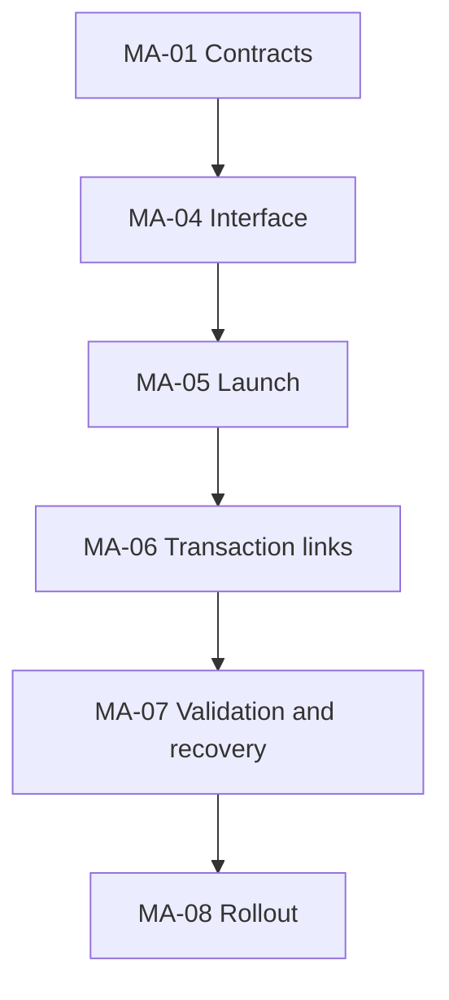

# Telegram Mini App tickets

- **Proposal status:** In progress
- **Ticket status:** MA-01/MA-04/MA-05 Done; MA-06 Ready; remaining tickets Backlog
- **Proposal:** [Telegram Mini App](PLAN.md)
- **Risks:** [Risk register](RISKS.md)

These are local implementation tickets. The owner authorized implementation and controlled rollout on 2026-10-01, including real-bot checks with disposable synthetic data. Dependencies are completion prerequisites; transitive edges are omitted. Keep this index, graph, and ticket metadata consistent.

## Ordered ticket index

| ID | Ticket | Status | Depends on |
| --- | --- | --- | --- |
| [MA-01](tickets/MA-01-contracts.md) | Scope and client contracts | Done | — |
| [MA-04](tickets/MA-04-interface.md) | Telegram interface adaptation | Done | [MA-01](tickets/MA-01-contracts.md) |
| [MA-05](tickets/MA-05-launch.md) | Bot launch integration | Done | [MA-04](tickets/MA-04-interface.md) |
| [MA-06](tickets/MA-06-transaction-links.md) | Transaction navigation and chat coexistence | Ready | [MA-05](tickets/MA-05-launch.md) |
| [MA-07](tickets/MA-07-validation.md) | Integrated validation and recovery rehearsal | Backlog | [MA-06](tickets/MA-06-transaction-links.md) |
| [MA-08](tickets/MA-08-rollout.md) | Controlled owner rollout | Backlog | [MA-07](tickets/MA-07-validation.md) |

## Dependency graph

Arrows mean **prerequisite → dependent ticket**. The table is a text alternative.

MA-02 (authentication) and MA-03 (private API) were removed from scope at the owner's request on 2026-10-01. Their IDs are retired; the six remaining tickets retain their IDs. Authentication is not a prerequisite for any ticket.

## Release gates

1. Scheduling and root-plan reconciliation are complete. [MA-01](CONTRACTS.md) settles launch/client contracts; no login or FP-001 dependency is introduced. Documentation establishes feasibility; it does not substitute for client launch evidence.
2. Complete each ticket's acceptance checks and record evidence before marking it Done. MA-05/MA-07 require real Telegram Web and ordinary-browser evidence. Native iOS/Android/Desktop checks are deferred under the owner's browser-only scope.
3. MA-07 requires automated checks and a deployment/recovery rehearsal. Preserve public dashboard behavior and backend/admin/webhook protections.
4. MA-08 executes the authorized production rollout after readiness checks. Real-bot synthetic checks are permitted earlier during integration. Record existing settings before changes, verify the hosted dashboard before advertising app entry points, and retain browser fallback on rollback.
5. Naturally arriving receipt and real 21:00 summary observations are deferred and remain open in `next_steps.md`; synthetic results never establish those live passes. Record deployments in `docs/history.md` and separate delivered behavior from deferred checks.

## Evidence convention

Use Backlog, Ready, In progress, Blocked, or Done. Keep uncompleted checks unchecked. Record change references, commands, real-client versions, results, and limitations using synthetic or redacted data. Never record credentials, private identifiers, full emails, balances, or production exports.
